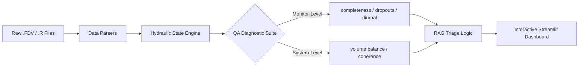

# Sewer Flow Analytical QA Framework (Arup Industry Dissertation)

> An end-to-end time series analysis and forecasting pipeline developed as part of my MSc Industry Dissertation with Arup to analyze 1,000+ complex environmental datasets using Python (Pandas, NumPy).

## 🔬 Methodology: Design Science (DSM)
This project adopts a **Design Science Methodology (DSM)** to prioritises **auditability, reproducibility, and transparency** in engineering processes.

## 🏗️ System Architecture
The framework follows a modular pipeline designed for deterministic evidence-based auditing.

## 🛠️ Requirements-to-Implementation Mapping
| Requirement | Implementation Anchor | Output |
|-------------|-----------------------|--------|
| Parse FDV & Rainfall | `parsers.py` | Structured DataFrames |
| Data Completeness | `calculate_completeness()` | % Acquisition KPI |
| Sensor Dropout | `detect_dropouts()` | Probe Fouling Flags |
| Diurnal Analysis | `calculate_diurnal_flatness()` | CV-based Health Flag |
| Hydraulic Coherence | `calculate_hydraulic_coherence()` | Pearson r Correlation |
| System Balance | `calculate_volume_imbalance()` | Up-Down Continuity % |
| Storm Segmentation | `segment_storms()` | Event Tables (WaPUG) |

## 🛠️ Core Features
- **Industry-Standard Parsing**: Support for FDV and Rainfall (.R) formats.
- **Advanced Time Series Analysis**: Performed exploratory data analysis and feature engineering on temporal data, improving validation accuracy by ~60% and reducing false alerts.
- **Predictive Modelling**: Built predictive models and clustering algorithms to identify seasonal patterns and long-term trends using `scikit-learn`.
- **System Balance**: Upstream-downstream volume balance analysis.
- **Reporting & Visualisations**: Created interactive visualisations using Plotly and Matplotlib to communicate complex findings to project stakeholders.
- **Hydrological Ingestion**: WaPUG/UDG compliant storm segmentation.

## 🧪 Experiments Conducted
The tool was validated using the Swansea dataset across 5 core experiments:
1. Missingness & Completeness
2. Upstream-Downstream Balance
3. RAG Health Classification
4. Dropout Detection
5. Rainfall Storm Segmentation
